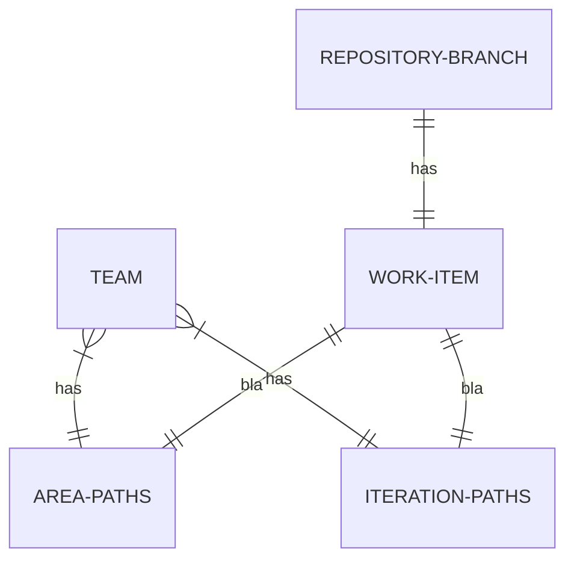

# OneProject Setup

TODO:

- explain premise of 'ING way of working': every commit is part of a branch that is part of a pull request that is part of an issue, that is part of a sprint.
- explain RPAA way of working. every work item also has an area to be able to link it to a certain repo.

Discuss: is is a better approach to simply search for work items that have a linked branch of a repo?
No, because there is no view within azure devops, we'll follow the UI. Note we can now do stuff like `doing open board`, which otherwise wouldn't be possible. 